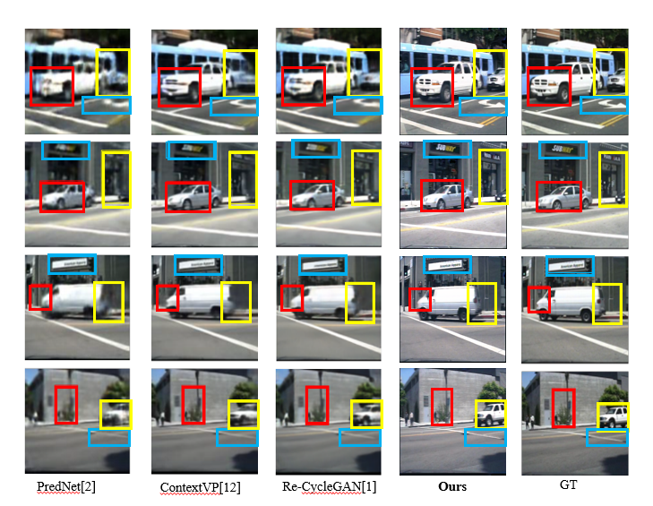

# **Bidirectional Dual Motion GAN for Video Frame Prediction in Intelligent Driving**

- ## Overview

  This repository contains the official implementation of our video prediction framework.  The model is designed to generate realistic future frames with consistent **appearance, depth, and motion**.  

  

  ### Key features include:

  - **Three-stream discriminator** (frame, depth, optical flow) for robust realism assessment.  
  - **Weight sharing strategy** to enforce cross-modal consistency.  
  - **Unsupervised monocular depth estimation** with left-right consistency.  
  - **Optical flow–based reconstruction loss** for motion-aware predictions.  
  - Evaluation scripts and pretrained models on **Human3.6M, KITTI, and Caltech Pedestrian**.  

  This codebase provides training, evaluation, and inference pipelines to reproduce our main results and serve as a foundation for further research in spatiotemporal prediction and video generation.

- - ## Environment

    The experiments were conducted under the following environment settings:

    - **Operating System**: Ubuntu 18.04  

    - **Python**: 3.7  

    - **PyTorch**: 1.1.0  

    - **CUDA**: 10.0  

    - **GPU**: NVIDIA RTX 2080 Ti (11GB) × 1  

    - **CPU**: 12 vCPU Intel(R) Xeon(R) Platinum 8255C @ 2.50GHz  

      ⚠️ Please note that the code is only guaranteed to run correctly on **this configuration or lower versions**.  Higher versions of PyTorch / CUDA may cause incompatibility issues.

## Directory Structure

├── data/ # Datasets or dataset preparation scripts
├── models/ # Model architectures
├── requirements.txt # Python dependencies
├── README.md # Project description
└── train.py # Entry point of the project

## Installation

We recommend using **conda** to manage the environment.

### 1. Create a new environment

```bash
conda create -n myenv python=3.7
conda activate myenv
```

### 2. Install dependencies

Install all required packages via:

```bash
pip install -r requirements.txt
```

## Usage

## Data Preparation

Before training, the datasets need to be preprocessed. You have two options:

### Option 1: Using Python scripts

1. **Split the dataset**:  

```bash
python split_dataset.py --data_dir path/to/raw/data --output_dir path/to/split/data
```

2. **Process the data**:

```
python process_data.py --input_dir path/to/split/data --output_dir path/to/processed/data
```

### Option 2: Using Jupyter Notebook

1. **Generate dataset pickle files directly**:
   Open and run:

```
crete_pkl.ipynb
```

This will create `.pkl` files for easy loading during training.

### Configuration

- Make sure to update the dataset paths in the `datasets` folder before training or evaluation.
- Paths should point to the location of your **processed or split datasets**.

### Required Module
Download the required optical flow and depth modules from the Required directory.

### Training

```
python train.py 
```

### Evaluation

```
python test.py 
```

## Configuration

**Important options:**

- `batch_size`: training batch size

- `learning_rate`: initial learning rate

- `epochs`: number of training epochs

- `model`: model backbone (e.g., ResNet, Transformer)

- `n_sequence`: length of frame sequence

  

## Results

| Dataset            | SSIM  | PSNR  | LPIPS  |
| ------------------ | ----- | ----- | ------ |
| KITTI              | 0.897 | 25.32 | 0.0879 |
| H36M               | 0.96  | 30.01 | 0.017  |
| Caltech Pedestrian | 0.939 | 33.79 | 0.0778 |

**Qualitative Results:**

- Visualization of predicted vs. ground truth





## Acknowledgements

### Datasets: KITTI, Human3.6M, Caltech Pedestrian

### Libraries: PyTorch, OpenCV, etc.

### Inspired by prior works (cite if applicable)
